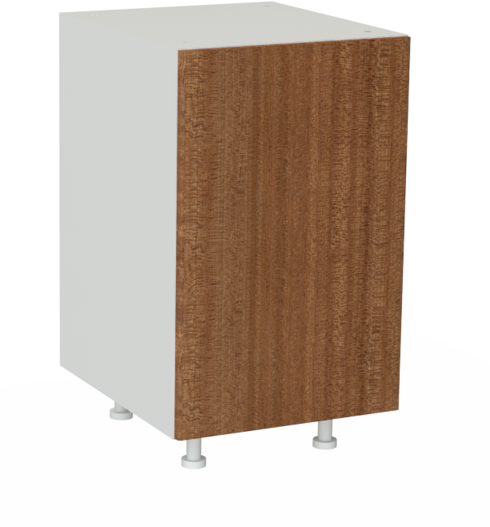
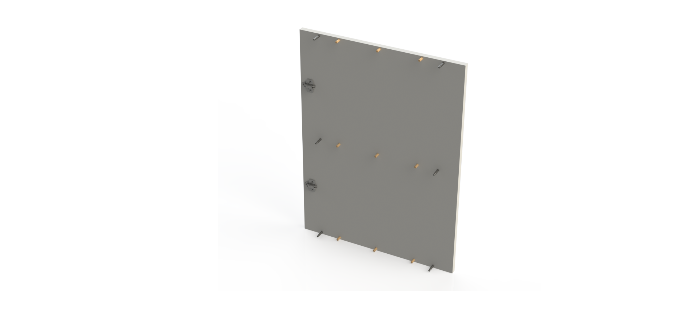

:index:`Single Cabinet`
-----------------------

.. tabularcolumns:: |l|c|c|c|

+------------------------------------+----------+-----------+-------------+
| Bill of Materials                                                       | 
+------------------------------------+----------+-----------+-------------+
| Item                               | Quantity | Price/Pcs | Total Price |
+====================================+==========+===========+=============+
| Cam Lock 15mm x 12.5mm             |    12    |    0.148€ |      1.776€ |
+------------------------------------+----------+-----------+-------------+
| Cam Bolt 6mm x 45.5mm              |    12    |    0.880€ |     10.560€ |
+------------------------------------+----------+-----------+-------------+
| Wooden Dowel Pin 8mm x 30mm        |    18    |    0.029€ |      0.522€ |
+------------------------------------+----------+-----------+-------------+
| Concealed Hinge (9mm Overlay)      |     2    |    1.690€ |      3.380€ |
+------------------------------------+----------+-----------+-------------+
| Hinge Mounting Plate               |     2    |    0.980€ |      1.960€ |
+------------------------------------+----------+-----------+-------------+
| Plastic Adjustable Legs 100mm      |     4    |    0.750€ |      3.000€ |
+------------------------------------+----------+-----------+-------------+
| Bakelite Door 755mm x 496mm x 18mm |     1    |   50.490€ |     50.490€ |
+------------------------------------+----------+-----------+-------------+
| Melamine Part 760mm x 562mm x 18mm |     2    |    8.211€ |      7.014€ |
+------------------------------------+----------+-----------+-------------+
| Melamine Part 562mm x 464mm x 18mm |     3    |    8.211€ |      6.423€ |
+------------------------------------+----------+-----------+-------------+
| Knob                               |     1    |    1.080€ |      1.080€ |
+------------------------------------+----------+-----------+-------------+
| **Total Cost**                                            |     86.205€ |
+------------------------------------+----------+-----------+-------------+

The single cabinet is a single module for the OpenDeskLab. It is comprised of the four melamine boards that form the frame and the bakelite door that has rounded edges. 

The sides of the frame can be used to mount the door either as right swing or as a left swing, with no modifications on the frame or the door itself. The hinges are standardized and all the holes can be predrilled in the CNC mill of the melamine supplier.

