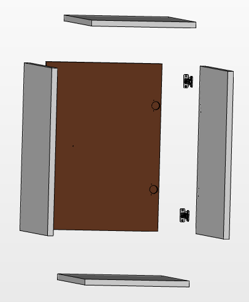

:index:`Single Cabinet`
-----------------------

.. figure::  ../../../img/single_cabinet.png
   :align:   center

   A rendering of the single cabinet module

The single cabinet is a 1W module for the OpenDeskLab. It is comprised of the four melamine boards that form the frame and the melamine door that has rounded edges. 

The sides of the frame can be used to mount the door either as right swing or as a left swing, with no modifications on the frame or the door itself. The hinges are standardized and all the holes can be predrilled in the CNC mill of the melamine supplier.

The frame itself uses cam bolts, so no power tools are required for easy manufacturing without expensive equipment.  

   The exploded view of the single cabinet