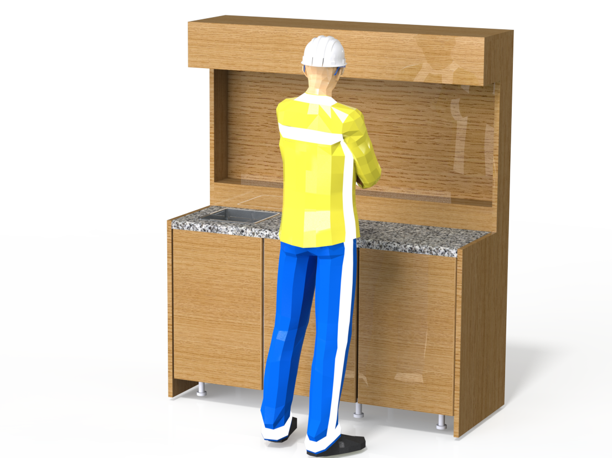

============================
Project :index:`Description`
============================

OpenDeskLab aims at creating an open design for laboratory desks that is

- Modular structure
- Reconfigurable dimensions
- Safe
- Easy to build
- Low cost
- Highly functional

:index:`Applications`
---------------------

The main audience that OpenDeskLab targets are highschool laboratories and home/diy/hackerspace/fablab places. Due to its' modular nature, OpenDeskLab can be used in a variety of applications, including (but not limited to) electrical, chemical and general use workbenches. It can provide electrical as well as gas connections, water supply and drain and of course ventilation. 