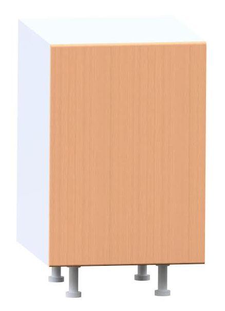

.. OpenDeskLab documentation master file, created by
   sphinx-quickstart on Wed Sep 30 19:01:20 2015.
   You can adapt this file completely to your liking, but it should at least
   contain the root `toctree` directive.

=======================================
Welcome to OpenDeskLab's documentation!
=======================================

Contents:

.. toctree::
   :maxdepth: 3
   :glob:

      Project Description <include/project_description>
      Specifications <include/specifications>
      Features <include/features>
      Open Data <include/open_data>
      Acknowledgments <include/acknowledgments>

   A rendering of the single cabinet module

Indices and tables
==================

* :ref:`genindex`
* :ref:`search`

